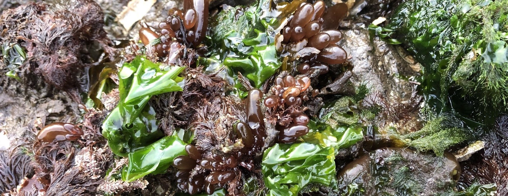
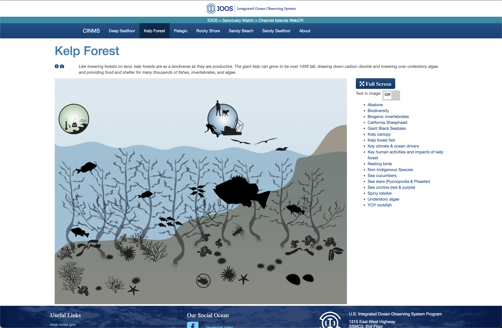

```{r load_packages, message=FALSE, warning=FALSE, include=FALSE} 
library(fontawesome)
library(tidyverse)
```


## {.tabset}

### `r fa(name="desktop")` <font color = "#2596be"> Web content </font>
`r fa(name = "hand-point-down")` Click on the dropdown below to navigate to three different  examples of websites I've helped develop and build. These projects all include components of community engagement, science communication, and resource protection

#### {.tabset .tabset-dropdown}

##### Finding Hal {.active}
[Findinghal](https://findinghal.org){target="blank"} - a community-science project oriented towards the recovery of endangered white abalone


##### CINMS

Web-enabled Condition Reports - an easier way to access Condition Reports for [CINMS](https://noaa-onms.github.io/cinms/){target="blank"}




##### OCNMS

Web-enabled Condition Reports - an easier way to access Condition Reports for [OCNMS](https://noaa-onms.github.io/ocnms/){target="blank"}


### `r fa(name="dumpster-fire")`<font color = "#2596be"> ~~RepRex examples~~ *still under construction* </font>

In the coming weeks, I plan to add my own reprex (i.e. reproducible example) code and figures from my recent publications. Please bear with me as I figure out the most streamlined way to do this! 


## {.toc-ignore}

***

#### More resources:
`r fa(name="twitter")` Check out [my twitter feed](https://twitter.com/BaronvonUrchin){target="blank"}  for more sci-comm!

`r fa(name="github")` For code, projects, and repos, check out my [Github profile](https://github.com/mspector13){target="blank"}

`r fa(name="laptop")` For more information about my previous experience in graduate school, check out [Lower Case Science](https://lowercasescience.weebly.com/){target="blank"}, my deprecated science communication blog 