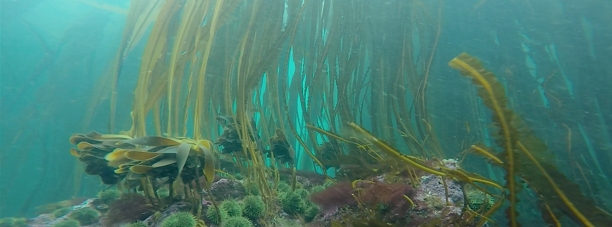
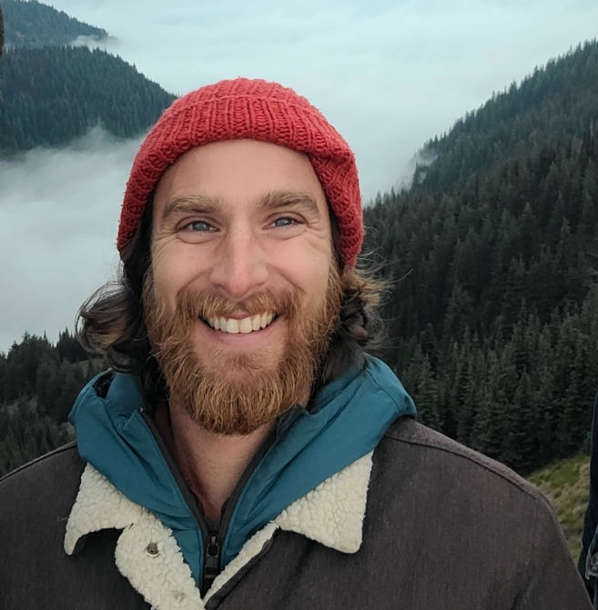

```{r load_packages, message=FALSE, warning=FALSE, include=FALSE} 
library(fontawesome)
```

***

{width=150%}

*** 

## <font color = "#2596be"> Welcome to Baron von Urchin's personal website </font>


</img>

<font size = "5"> My name is Pike Spector I am currently a marine scientist with [NOAA Olympic Coast National Marine Sanctuary](https://olympiccoast.noaa.gov/){target="blank"}. In my day job, I support research operations and data management for the sanctuary. Trained in kelp forest ecology, I'm passionate about marine science, phycology, conservation, restoration, and open data science.

<br>

For more information, visit the [About page](about_me.html) </font>

<br>

## On this site you can also find links to my: </font>
<font size= "5"> 

1. [Publications](publications.html)
2. [Curriculum vitae](cv.html)
3. [Example code](code.html)

</font>

***

#### More resources:
`r fa(name="twitter")` Check out [my twitter feed](https://twitter.com/BaronvonUrchin){target="blank"}  for more sci-comm!

`r fa(name="github")` For code, projects, and repos, check out my [Github profile](https://github.com/mspector13){target="blank"}

`r fa(name="laptop")` For more information about my previous experience in graduate school, check out [Lower Case Science](https://lowercasescience.weebly.com/){target="blank"}, my deprecated science communication blog 
