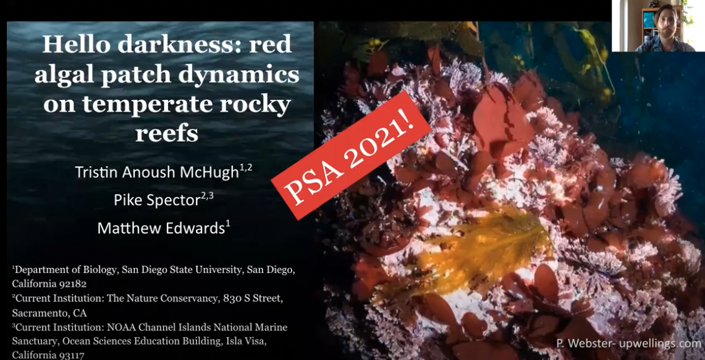
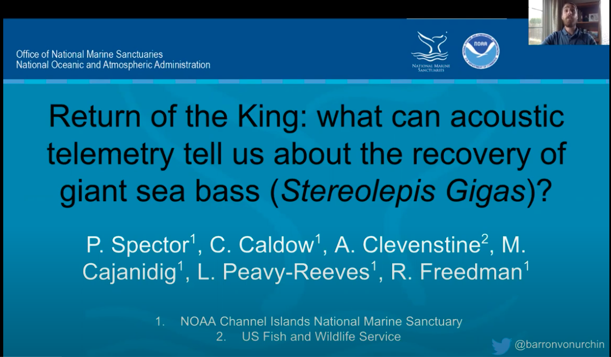

```{r load_packages, message=FALSE, warning=FALSE, include=FALSE} 
library(fontawesome)
```


## {.tabset}

### `r fa(name="book")` <font color = "#2596be"> Peer-reviewed publications </font>

#### 2022
- <p>Network analysis reveals aggregation behaviour of a historically overfished predator at an offshore island.<br>
  Journal of Fish Biology: [https://doi.org/10.1111/jfb.15181](https://doi.org/10.1111/jfb.15181){target="blank"}<br>
  **Spector M.**ª, Clevenstine A.ª, Caldow C., Cajandig M., Duncan, L., Peavy-
Reeves L., and Freedman R. </p>

  <font size = "2"> ªBoth authors contributed equally to this paper </font>

#### 2021
- <p>Webenizing Condition Reports: communicating data-driven ecosystem indicators in a visually engaging and interactive online platform.<br>
  [Sanctuary Conservation Series](https://sanctuaries.noaa.gov/science/conservation/webenizing-condition-reports.html){target="blank"}<br>
  **Spector M.**, Best B., Raganathan J., Murray T., Caldow C., Brown J., Canonico G., and DeVogelaere A.</p>

#### 2020
- <p>Modeling the impacts of kelp deforestation on benthic primary production.<br>
  Algae: [https://doi.org/10.4490/algae.2020.35.8.19](https://doi.org/10.4490/algae.2020.35.8.19){target="blank"}<br>
  **Spector M.** and M Edwards </p>

- <p>Marine deforestation leads to widespread loss of ecosystem function <br>
  PLoS ONE: [https://doi.org/10.1371/journal.pone.0226173](https://doi.org/10.1371/journal.pone.0226173){target="blank"} <br>
  Edwards M., Konar B., Kim J-H., Gabara S., Sullaway G., McHugh T., **Spector M.**, and S Small.</p>

### `r fa(name="comments")`<font color = "#2596be"> Science Communication </font>

#### 2020
- <p>A safe haven in a changing world: Can Channel Islands National Marine Sanctuary Serve as a Local Refuge Against Ocean Acidification?<br>
  [Office of National Marine Sanctuaries - Webstory](https://sanctuaries.noaa.gov/news/feb20/channel-islands-ocean-acidification-refuge.html){target="blank"}</p>

#### 2019
- <p>Dis-Aleutianed: Where the Wild Winds Blow<br>
  [The Xylom](https://www.thexylom.com/post/dis-aleutianed-where-the-wild-winds-blow-1?fbclid=IwAR32kmyhM3OeAEWDpp8RXg4dXcJT53sT3NBgWwDAc_lS-nFP8hgBdGCy_KU){target="blank"}</p>

- <p>We’re gonna need a bigger boat: Gentle giants return to Channel Islands National Marine Sanctuary.<br>
  [Office of National Marine Sanctuaries - Webstory](https://sanctuaries.noaa.gov/news/may19/basking-shark-tagging-channel-islands-national-marine-sanctuary.html){target="blank"}</p>
  
### `r fa(name="comments")` <font color = "#2596be"> Recorded talks </font>


[Hello darkness: red algal patch dynamics on temperate rocky reefs](https://www.youtube.com/watch?v=hA7yh_ZiopM){target="blank"}

This talk, about a series of clearing experiments conducted in San Diego and Monterey, was presented to the Phycological Society of America's annual meeting in 2021


[Return of the King: what can acoustic telemtry tell us about the reocvery of giant sea bass (*Stereolepis gigas*)](https://www.youtube.com/watch?v=GGFxF1PAvj0&t=6s){target="blank"}

This talk was presented to the Western Society of Naturalist's annual meeting in 2020 regarding our [recent GSB publication](https://onlinelibrary.wiley.com/doi/abs/10.1111/jfb.15181){target="blank"}


## {.toc-ignore}

***

#### More resources:
`r fa(name="twitter")` Check out [my twitter feed](https://twitter.com/BaronvonUrchin){target="blank"}  for more sci-comm!

`r fa(name="github")` For code, projects, and repos, check out my [Github profile](https://github.com/mspector13){target="blank"}

`r fa(name="laptop")` For more information about my previous experience in graduate school, check out [Lower Case Science](https://lowercasescience.weebly.com/){target="blank"}, my deprecated science communication blog 