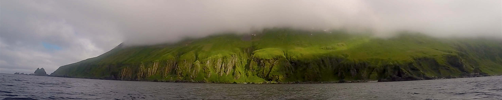
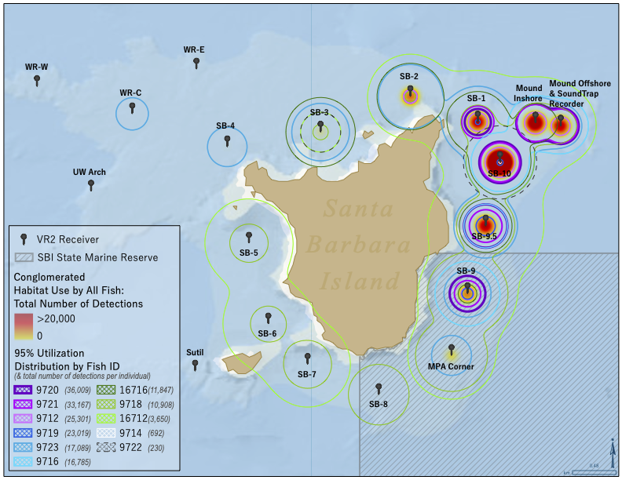
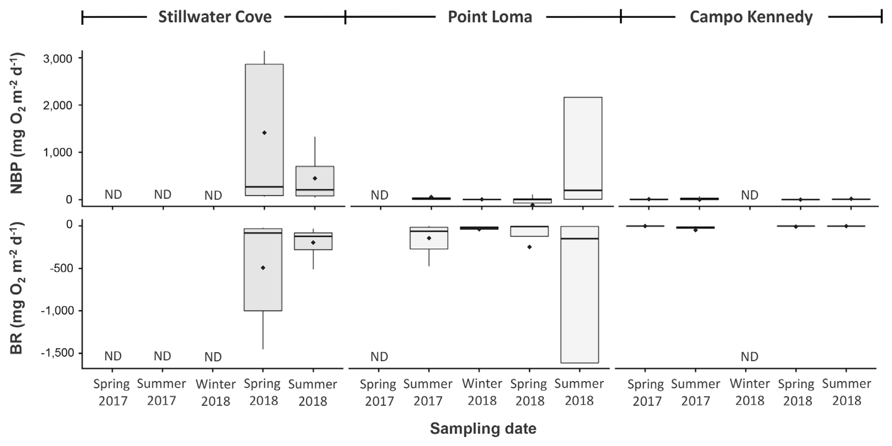
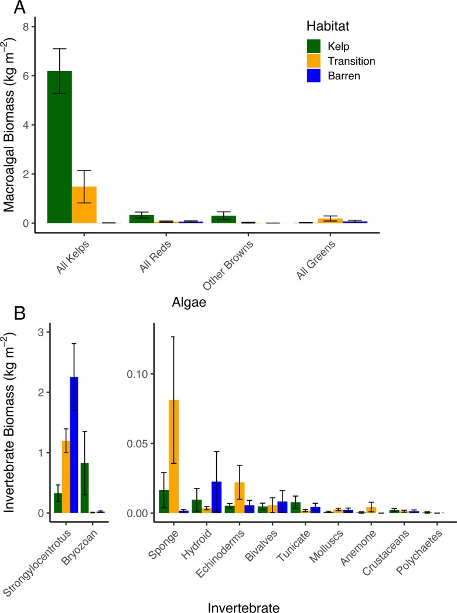

```{r load_packages, message=FALSE, warning=FALSE, include=FALSE} 
library(fontawesome)
```



## {.tabset}

### Species distributions - giant sea bass movement



Network analysis reveals aggregation behaviour of a historically overfished predator at an offshore island [Spector et al. 2022](https://doi.org/10.1111/jfb.15181){target="blank"}

*** 
As a research operations specialist with [Channel Islands National Marine Sanctuary](https://noaa-onms.github.io/cinms/){target="blank"}, I worked on understanding the movement and behaviour of giant black sea bass (*Stereolepis gigas*) around Santa Barbara Island. A remote island off the coast of Southern California, this remote site afford us a unique insight into the behaviour of these reef predators. Once on the brink of extinction, giant sea bass are making a remarkable recovery in California's waters, thanks (in part) to regulations and management efforts, as well as cross-border collaborations. 


### Algal production - speaking for the understory



Modeling the impacts of kelp deforestation on benthic primary production
[Spector M. and M. Edwards 2020](https://doi.org/10.4490/algae.2020.35.8.19){target="blank"}

***

For my master's dissertation at San Diego State University, I quantified the contributions of benthic macroalgae to net ecosystem productivity (NEP). Kelp forests are generally considered to be excellent atmospheric carbon dioxide sinks, sequestering vast amounts of CO2 via photosynthesis. While kelps themselves, in this case, the giant kelp (*Macrocystis pyrifera*) is the posterchild for rapid productivity, I was interested in  understory and subcanopy macroalgae. Often overlooked in NEP studies, these algae are incredibly important sources of food and shelter for many kelp forest creatures. In this study, I investigated how light dyanmics impact NEP contributions from these algae, and modeled this loss under extreme deforestation scenarios. 


### Marine deforestation and ecosystem function



Marine deforestation leads to widespread loss of ecosystem function
[Edwards et al. 2020](https://doi.org/10.1371/journal.pone.0226173){target="blank"}

***

As a graduate student researcher at San Diego State University, I participated on two back to back research cruises spanning the Aleutian Archipelago. For the summers of 2016 and 2017, the Edwards Lab (SDSU) and the Konar Lab (UAF) investigated patterns of marine deforestation and ecosystem function in the Aleutians. Building on work started by Dr. Jim Estes in the 1970s, this collaborative project quantified the impacts of urchin barren formation and persistence across many degrees of latitude. Specifically, as part of the Edwards Lab, I helped develop a novel a approach to quantifying net ecosystem productivity (NEP) *in situ* in kelp forests, urchin barrens, and the transition zone between the two


## {.toc-ignore}

***

#### More resources:
`r fa(name="twitter")` Check out [my twitter feed](https://twitter.com/BaronvonUrchin){target="blank"}  for more sci-comm!

`r fa(name="github")` For code, projects, and repos, check out my [Github profile](https://github.com/mspector13){target="blank"}

`r fa(name="laptop")` For more information about my previous experience in graduate school, check out [Lower Case Science](https://lowercasescience.weebly.com/){target="blank"}, my deprecated science communication blog 